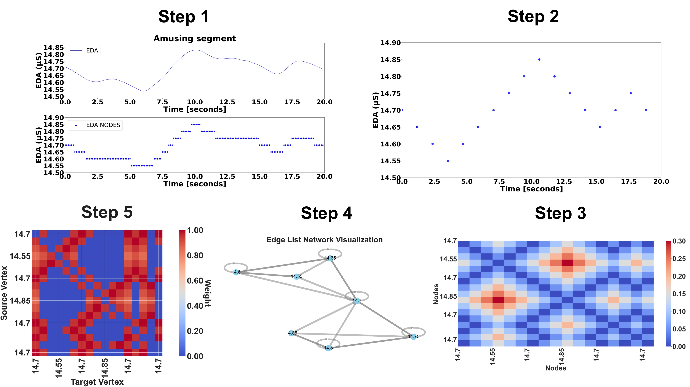

# EDA-Graph

**Graph Signal Processing of Electrodermal Activity for Emotional States Detection.**

Reference implementation of

> Mercado-Diaz, L. R., Veeranki, Y. R., Marmolejo-Ramos, F., &
> Posada-Quintero, H. F. (2024). *EDA-Graph: Graph Signal Processing of
> Electrodermal Activity for Emotional States Detection.*
> **IEEE Journal of Biomedical and Health Informatics.**
> [doi:10.1109/JBHI.2024.3405975](https://doi.org/10.1109/JBHI.2024.3405975)
> - [IEEE Xplore](https://ieeexplore.ieee.org/document/10539177)

This repository contains **only** the code needed to:

1. Build an EDA-graph from an electrodermal-activity signal
   (Section II-B and II-C of the paper).
2. Extract the **58 graph / node / edge-level features** of Table II.

It does **not** include classification, statistical-analysis or
plotting utilities - those live outside this package and the
published results in the paper are the reference.



---

## 1. Install

```bash
git clone https://github.com/jouninlrmd/eda-graph
cd eda-graph
pip install -r requirements.txt
pip install -e .
```

## 2. Run on a CASE-formatted dataset

```bash
python scripts/extract_features.py \
    --data-root /path/to/CASE/interpolated \
    --output EDA_graph_features.csv \
    --n-jobs -1
```

The output CSV has **1 row per window** and the following columns (in
this exact order):

```
subject, <58 graph features>, valence, arousal, class
```

where `<58 graph features>` is the list exported as
`edagraph.features.GRAPH_FEATURE_NAMES` (see
`edagraph/features/graph_features.py`).

## 3. Use from Python

```python
from edagraph import Config, EDAGraphPipeline, build_eda_graph, extract_graph_features

# Batch extraction over a CASE folder
pipe = EDAGraphPipeline(cfg=Config(), n_jobs=-1)
df = pipe.extract_graph_features_dataset("CASE/interpolated")
df.to_csv("EDA_graph_features.csv", index=False)

# Or on a single 60 s window of your own EDA
import numpy as np
window = np.load("my_eda_60s.npy")      # 480 samples at 8 Hz
g = build_eda_graph(window, Config())
features = extract_graph_features(g)    # dict, 58 entries
```

---

## 4. Dataset layout

The loader assumes the CASE dataset layout (Sharma et al., 2019):

```
CASE/
└── interpolated/
    ├── annotations/
    │   ├── sub_1.csv  ...  sub_30.csv
    └── physiological/
        ├── sub_1.csv  ...  sub_30.csv
```

Each `annotations/sub_X.csv` has the columns
`jstime, valence, arousal, video`; each `physiological/sub_X.csv` has
`daqtime, gsr, ...`. The EDA signal is taken from the `gsr` column at
**1000 Hz**.

Class mapping follows the paper:

| Video id | Class id | Label       |
|----------|----------|-------------|
| 10, 11   | 0        | Neutral (N) |
| 1, 2     | 1        | Amused (A)  |
| 3, 4     | 2        | Bored  (B)  |
| 5, 6     | 3        | Relaxed(R)  |
| 7, 8     | 4        | Scared (S)  |

---

## 5. Methodology (reproduced verbatim from the paper)

### 5.1 Signal preprocessing (Section II-B)

1. Standard decimation from `fs_raw = 1000 Hz` to `fs = 8 Hz`.
2. 4th-order zero-phase Butterworth **low-pass** at `lowpass_hz = 1 Hz`,
   applied after decimation.
3. 1-second (8-sample) **median filter**.
4. Sliding windowing: `window_sec = 60 s`, 50 % overlap
   (`window_step_sec = 30 s`). A window is kept only when at least
   80 % of its samples share the same emotional label.

### 5.2 EDA-graph construction (Section II-C)

**Step 1 - Quantisation (eq. 1):**

$$ x_{\text{quantized}} = Q \cdot \operatorname{round}(x_{\text{original}} / Q) $$

with `Q = 0.05 μS`.

**Step 2 - Node definition (eq. 2):** the nodes are the unique values
of `x_quantized`, keeping only the first occurrence of each new value.

**Step 3 - Distance (eq. 3):** Euclidean distance over 1-D node values,
`D_ij = |x_i - x_j|`.

**Step 4 - Nearest neighbours:** each node connects to its **`K = 8`**
closest neighbours (matched to the 8 Hz sampling rate).

**Step 5 - Adjacency (eq. 5):** edge weight `w_ij = 1 / D_ij`.

### 5.3 Features (Section II-D and Table II)

The 58 features are grouped as (see
`edagraph.features.FEATURE_LEVELS`):

* **Graph-level** - total triangle number, graph energy, transitivity,
  clique counts, number of cliques, is-chordal, center, diameter,
  radius, periphery, average clustering, Weisfeiler-Lehman kernel,
  graph-/Laplacian-spectrum std, avg triangle participation, and
  GS/LS mean/min/max/median/skew/kurt of magnitude and phase.
* **Node-level** - total degree / closeness / betweenness /
  eigenvector / load / harmonic centrality, total PageRank,
  total hubs, number of nodes, max / min / median degree,
  closeness centrality, eccentricity.
* **Edge-level** - total flow centrality, total log flow centrality,
  number of edges, assortativity, Spearman correlation.

Feature names and canonical column order are defined in
`edagraph/features/graph_features.py::GRAPH_FEATURE_NAMES`.

---

## 6. Repository layout

```
eda-graph/
├── edagraph/                     Core package
│   ├── config.py                 Pipeline hyper-parameters
│   ├── preprocessing.py          Filtering / decimation / windowing
│   ├── quantization.py           Amplitude quantisation, node definition
│   ├── graph.py                  k-NN graph construction
│   ├── features/
│   │   └── graph_features.py     58 EDA-graph features (Table II)
│   ├── dataset.py                CASE-format loader
│   └── pipeline.py               Joblib-parallel batch extraction
├── scripts/
│   └── extract_features.py       CLI: folder -> features CSV
├── tests/test_pipeline.py        Smoke test on a synthetic signal
├── config.yaml                   Default Config serialised to YAML
├── requirements.txt / setup.py   Install recipe
├── EDA_graph_features.csv        Reference feature file from the paper
├── EDA_Traditional_Features.csv  Reference traditional-feature file
└── Paper_Figures/                Figures from the paper
```

---

## 7. Citing

```bibtex
@article{mercado2024edagraph,
  title   = {EDA-Graph: Graph Signal Processing of Electrodermal Activity for Emotional States Detection},
  author  = {Mercado-Diaz, Luis R. and Veeranki, Yedukondala Rao and Marmolejo-Ramos, Fernando and Posada-Quintero, Hugo F.},
  journal = {IEEE Journal of Biomedical and Health Informatics},
  year    = {2024},
  doi     = {10.1109/JBHI.2024.3405975}
}
```

## 8. Authors and institution

* Luis Roberto Mercado-Diaz, PhD
* Yedukondala Rao Veeranki, PhD
* Fernando Marmolejo-Ramos, PhD
* Hugo F. Posada-Quintero, PhD

Developed at the **Posada-Quintero Laboratory**, University of Connecticut.

## 9. License

Released under the **MIT License**.
