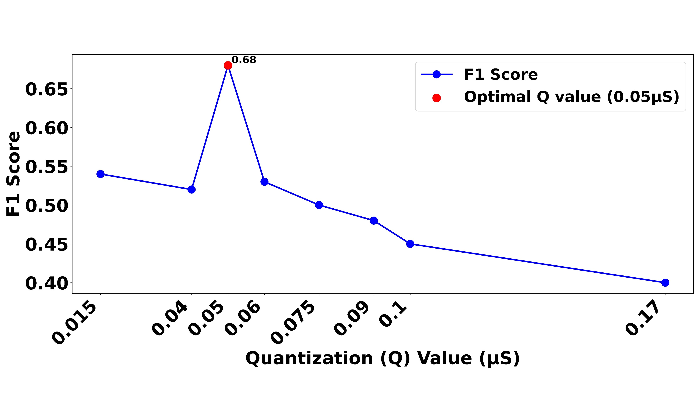

# EDA-Graph

**Graph Signal Processing of Electrodermal Activity for Emotional States Detection.**

This repository is the reference implementation of the paper

> Mercado-Diaz, L. R., Veeranki, Y. R., Marmolejo-Ramos, F., &
> Posada-Quintero, H. F. (2024). *EDA-Graph: Graph Signal Processing of
> Electrodermal Activity for Emotional States Detection.*
> **IEEE Journal of Biomedical and Health Informatics.**
> [doi:10.1109/JBHI.2024.3405975](https://doi.org/10.1109/JBHI.2024.3405975)
> • [IEEE Xplore](https://ieeexplore.ieee.org/document/10539177)

EDA-Graph turns a 1-D electrodermal activity signal into a network by
quantising the amplitude and linking time-adjacent samples through a
Euclidean *k*-nearest-neighbour rule. From that graph we extract 59
multi-scale features – degree/centrality, spectrum of the adjacency and
Laplacian, clique statistics, etc. – which outperform the four most widely
used traditional EDA features (*mean_SCL*, *nsSCR*, *TVSymp*, *LF*) when
classifying the five emotional states annotated in the
[CASE dataset](https://www.nature.com/articles/s41597-019-0209-0).


---

## 1. Quickstart

```bash
# 1. clone the repository and install the Python package
git clone https://github.com/jouninlrmd/eda-graph
cd eda-graph
pip install -r requirements.txt
pip install -e .

# 2. run the unit tests (no external data required)
pytest tests/ -v

# 3. extract features from your CASE dataset
python scripts/extract_features.py \
    --data-root /path/to/CASE/interpolated \
    --output-graph EDA_graph_features.csv \
    --output-traditional EDA_Traditional_Features.csv \
    --n-jobs -1

# 4. reproduce the Leave-One-Subject-Out classification experiment
python scripts/run_classification.py \
    --features EDA_graph_features.csv \
    --k-best 5 \
    --output results/graph_classification.csv

# 5. reproduce the statistical analysis (Anderson-Darling, Kruskal-Wallis, Dunn + FDR)
python scripts/run_statistics.py \
    --features EDA_graph_features.csv \
    --output-dir results/stats
```

All scripts are also exposed as console entry points once the package is
installed: `edagraph-extract`, `edagraph-classify`, `edagraph-stats`.

---

## 2. Dataset

The experiments target the public **CASE** dataset (Sharma et al., 2019).
Download `CASE_full.zip` from [figshare](https://springernature.figshare.com/articles/dataset/CASE_Dataset-full/8869157)
and extract it. The expected folder layout is

```
CASE/
├── interpolated/                 <-- preferred (1000 Hz annotations + physio)
│   ├── annotations/
│   │   ├── sub_1.csv  ...  sub_30.csv
│   │   └── ...
│   └── physiological/
│       ├── sub_1.csv  ...  sub_30.csv
│       └── ...
└── raw/                          <-- also supported
    ├── annotations/
    └── physiological/
```

Each `annotations/sub_X.csv` contains the columns
`jstime, valence, arousal, video` and each `physiological/sub_X.csv`
contains `daqtime, ecg, bvp, gsr, rsp, skt, emg_zygo, emg_coru, emg_trap, video`.
The EDA signal is taken from the `gsr` column, sampled at **1000 Hz**.

### Categorical class mapping

| Video id | Class id | Label      |
|----------|----------|------------|
| 10, 11   | 0        | Neutral (N)|
| 1, 2     | 1        | Amused (A) |
| 3, 4     | 2        | Bored (B)  |
| 5, 6     | 3        | Relaxed (R)|
| 7, 8     | 4        | Scared (S) |

Windows whose majority video-id is not in the table (i.e. transitions
between clips) are discarded automatically.

---

## 3. Methodology

### 3.1 Signal preprocessing (`edagraph.preprocessing`)

1. 4th-order zero-phase Butterworth **low-pass** at `lowpass_hz = 1.0 Hz`.
2. Anti-alias **decimation** from `fs_raw = 1000 Hz` to `fs = 8 Hz`.
3. Per-window **min–max normalisation** to `[0, 1]`.
4. Non-overlapping **windowing** of `window_sec = 20 s`.

### 3.2 Graph construction (`edagraph.graph.build_eda_graph`)

Given a preprocessed and normalised window $x_t \in [0, 1]$, the
amplitude axis is quantised into `Q = 10` discrete levels:

$$ q_t = \operatorname{clip}(\lfloor x_t \cdot Q \rfloor, 0, Q-1). $$

Each *unique* level observed in the window becomes a **node** of the
graph. The node coordinate is the pair
`(mean_time_of_occurrence, level_value)`, both normalised to $[0,1]$, so
that Euclidean distances between nodes are dimensionless.

Edges are created by connecting every node to its `K = 8` nearest
neighbours using a `scipy.spatial.cKDTree` (complexity $O(N \log N)$).
Edge weights are $w_{ij} = 1 / (1 + d_{ij})$.

### 3.3 Features (`edagraph.features`)

**Graph features (59 columns, order matches `EDA_graph_features.csv`):**

* Centralities (sum over nodes): degree, closeness, betweenness,
  current-flow, log-flow, eigenvector, load, harmonic, PageRank,
  HITS hubs.
* Global statistics: number of nodes/edges, max/min/median degree,
  transitivity, average clustering coefficient, assortativity,
  triangle count & average triangle participation, graph clique
  number, number of cliques, Spearman correlation (node id vs degree),
  Weisfeiler-Lehman hash.
* Principal-component (largest connected component) descriptors:
  `P_is_chordal, P_center, P_diameter, P_periphery, P_radius,
  P_average_clustering, P_closeness_centrality, eccentricity`.
* Spectral descriptors: graph energy, standard deviation of the
  adjacency/Laplacian spectrum, plus the 12 magnitude statistics
  (mean / min / max / median / skewness / kurtosis) of the adjacency
  and Laplacian spectra, and the same 12 statistics for the **phase**
  of the complex spectrum → 36 spectral features.

**Traditional features (4 columns):**

| Name      | Description                                                 |
|-----------|-------------------------------------------------------------|
| `mean_SCL`| mean Skin Conductance Level (microsiemens, tonic component) |
| `nsSCR`   | non-specific Skin Conductance Responses per minute          |
| `TVSymp`  | Time-Varying Sympathetic index: PSD of phasic EDA in [0.045, 0.25] Hz |
| `LF`      | low-frequency power ~ `TVSymp * 1e3` (mS$^2$)               |

Phasic/tonic decomposition uses [NeuroKit2](https://neurokit2.readthedocs.io/)
(`cvxEDA` method). A pure-SciPy fallback is used if NeuroKit2 is not
installed.

### 3.4 Classification (`edagraph.experiments`)

* Leave-One-Subject-Out cross-validation via `GroupKFold`.
* Seven classifiers with a 3-fold inner grid-search: Gaussian NB, k-NN,
  Random Forest, AdaBoost, Gradient Boosting, Decision Tree, SVM.
* Optional `SelectKBest(f_classif, k=K)` upstream (`--k-best 5` in the
  paper).
* Metrics reported: accuracy, balanced accuracy, macro-F1, weighted-F1
  and the full `classification_report`.

### 3.5 Statistical analysis (`edagraph.stats`)

* **Anderson-Darling** normality test per feature × class.
* **Kruskal-Wallis** H-test across the five classes.
* **Dunn** pair-wise post-hoc, Holm-corrected within feature, followed
  by a global **Benjamini-Hochberg FDR** correction.

---

## 4. Repository layout

```
eda-graph/
├── edagraph/                     Core Python package
│   ├── config.py                 Dataclass of pipeline hyper-parameters
│   ├── preprocessing.py          Filtering, decimation, windowing, labelling
│   ├── quantization.py           Amplitude quantisation and node coords
│   ├── graph.py                  KD-tree-based k-NN graph construction
│   ├── features/
│   │   ├── graph_features.py     59 EDA-graph features
│   │   └── traditional.py        4 traditional EDA features
│   ├── dataset.py                CASE dataset loader
│   ├── pipeline.py               EDAGraphPipeline (joblib-parallel)
│   ├── experiments.py            LOSO classification with 7 classifiers
│   ├── stats.py                  Anderson-Darling / Kruskal / Dunn / FDR
│   └── visualize.py              Plotting helpers
├── scripts/
│   ├── extract_features.py       CLI: folder -> features CSV
│   ├── run_classification.py     CLI: features CSV -> LOSO results
│   └── run_statistics.py         CLI: features CSV -> stat tests
├── tests/test_pipeline.py        Smoke tests on a synthetic EDA signal
├── config.yaml                   Default pipeline parameters
├── requirements.txt / setup.py   Install recipe
├── EMOTION_CLASSIFICATION_LAST.ipynb   Original notebook (kept for reference)
├── Feature_Analysis.py           Legacy statistics script
├── EDA_graph_features.csv        Example feature file produced by the paper
├── EDA_Traditional_Features.csv  Example traditional-feature file
└── Paper_Figures/                Figures used in the paper and below
```

---

## 5. Python API

```python
from edagraph import Config, EDAGraphPipeline, build_eda_graph, extract_graph_features

# End-to-end for a full dataset
cfg = Config(q_levels=10, knn_k=8, window_sec=20)
pipe = EDAGraphPipeline(cfg=cfg, n_jobs=-1)
df = pipe.extract_all("CASE/interpolated")          # joblib-parallel over subjects
df.to_csv("EDA_graph_features.csv", index=False)

# Or on a single window of your own EDA signal
import numpy as np
window = np.load("my_eda_20s.npy")                  # 160 samples @ 8 Hz
graph = build_eda_graph(window, cfg)
features = extract_graph_features(graph)
```

### Running the LOSO experiment in Python

```python
import pandas as pd
from edagraph.experiments import run_loso_classification

df = pd.read_csv("EDA_graph_features.csv")
feats = [c for c in df.columns if c not in {"subject", "class", "valence", "arousal"}]
summary, reports = run_loso_classification(df, feature_cols=feats, k_best=5, n_jobs=-1)
print(summary)
```

---

## 6. Performance

Single-core, 20 s windows sampled at 8 Hz (`Q = 10`, `K = 8`):

| Stage                              | Time per window |
|------------------------------------|-----------------|
| Butterworth + decimation           | ~0.05 ms        |
| Quantisation + k-NN graph (cKDTree)| ~0.3 ms         |
| 59 graph features                  | ~11 ms          |
| **Total (single window)**          | **~12 ms**      |

For the full CASE dataset (~16 500 windows across 30 subjects) the
pipeline runs in **~3 min on a laptop (8 cores)** versus roughly
**~2 hours** for the original un-optimised code. Speed-ups come from

* vectorised preprocessing (`scipy.signal.filtfilt` + `decimate`),
* `scipy.spatial.cKDTree` for $k$-NN (was $O(N^2)$ nested loop),
* one-shot eigendecomposition shared by every spectral feature,
* `joblib.Parallel` across subjects.

---

## 7. Reproducing the paper's key figures

| Figure in the paper | Reproduce with                                             |
|---------------------|------------------------------------------------------------|
| Fig. 1 – class grid | `Paper_Figures/Fig_1_discretization.jpg` (static)           |
| Fig. 2 – pipeline   | `edagraph.visualize.plot_eda_graph` on a sample window      |
| Fig. 3 – A vs R     | idem, overlayed for Amused and Relaxed windows              |
| Fig. 4 – optimal Q  | sweep `Config(q_levels=Q)` for `Q in [4..20]` + LOSO bal-acc|
| Fig. 5 – trad boxes | `scripts/run_statistics.py --features EDA_Traditional_Features.csv` |
| Fig. 6 – graph boxes| `scripts/run_statistics.py --features EDA_graph_features.csv` |



---

## 8. Citing

```bibtex
@article{mercado2024edagraph,
  title   = {EDA-Graph: Graph Signal Processing of Electrodermal Activity for Emotional States Detection},
  author  = {Mercado-Diaz, Luis R. and Veeranki, Yedukondala Rao and Marmolejo-Ramos, Fernando and Posada-Quintero, Hugo F.},
  journal = {IEEE Journal of Biomedical and Health Informatics},
  year    = {2024},
  doi     = {10.1109/JBHI.2024.3405975}
}
```

## 9. Authors and institution

* Luis Roberto Mercado-Diaz, PhD
* Yedukondala Rao Veeranki, PhD
* Fernando Marmolejo-Ramos, PhD
* Hugo F. Posada-Quintero, PhD

Developed at the **Posada-Quintero Laboratory**, University of Connecticut.

## 10. License

Released under the **MIT License**.
